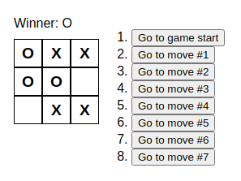

# Noughtx App

_**Note:** this project is a work in progress_

A spartan tic-tac-toe game.

The name 'Noughtx' derives from the portmanteau of 'nought' and 'X'.

## Table Of Contents

- [Demo](#demo)
- [Introduction](#introduction)
- [Features](#features)
- [Stack](#stack)

## Demo

## Introduction

The objective is to learn and apply fundamentals of React: components, props, and state.

## Features

- 'Time Machine':

  

## Stack

- React 18
- Vite 5
